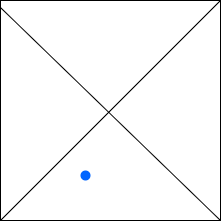
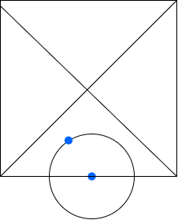
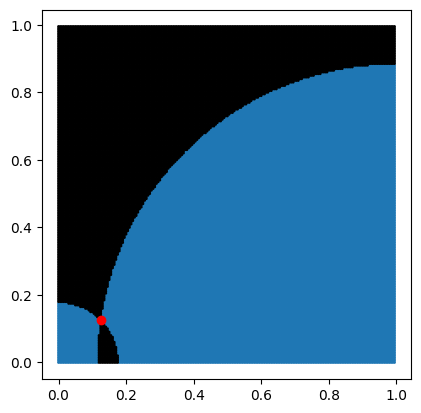

# Jane Street Puzzle Solution

We aim to solve a geometric probability problem involving points within a unit square, as described in Jane Street's monthly puzzle. You can view the original problem here: [Jane Street Puzzle](https://www.janestreet.com/puzzles/current-puzzle/).

## Approach and Strategy

Rather than randomly selecting two points within the unit square, we simplify the problem by fixing one "blue point" and analyzing configurations relative to this fixed point.

### Step 1: Positioning the Fixed Point
To start, we place the blue point in the lower triangle of the unit square, with the bottom-left corner (origin $(0,0)$) as the reference point. This allows us to treat the x-axis as the "closest border" to our fixed point.

#### Illustration 1: Initial Point Selection
Below is an illustration showing the blue point within the lower left triangle:



### Step 2: Exploring Valid Points for the Second Point
Now, let $x_0$ be a point on the x-axis. We imagine a circle centered at $(x_0, 0)$ such that any point on this circle’s perimeter would be a valid choice for the second "red point." As $x_0$ varies along the x-axis, the red point’s position remains bounded within circles centered at $(0,0)$ and $(1,0)$, without any intersections.

#### Illustration 2: Circles Showing Valid Points
The following diagram illustrates this relationship between the red points and valid positions around circles centered at $(0,0)$ and $(1,0)$:



### Step 3: Numerical Verification
To validate our approach, we numerically verify that the valid red points lie within the highlighted blue region shown in the diagram below, covering all possible values for $0 \leq x_0 \leq 1$.

#### Illustration 3: Numerical Validation of Regions


## Mathematical Formulation

### Setting up the Area and Probabilities
Let the fixed blue point be represented as $b = (x, y)$. Our objective is to calculate the probability that, given the blue point, a second randomly chosen red point falls within a specified distance.

1. **Circle Definition**: The radius of the circle centered at $(0,0)$ is $\sqrt{x^2 + y^2}$, while the circle centered at $(1,0)$ has a radius $\sqrt{(1 - x)^2 + y^2}$.
2. **Probability Calculation**: For any fixed point, we calculate the probability as follows:
   $$
   P = \frac{\pi (x^2 + y^2)}{4} + \frac{\pi ((1 - x)^2 + y^2)}{4} - 2I
   $$
   where $I$ represents the area of intersection between the two circles. We include $\frac{1}{4}$ as we consider only a quarter of each circle's area.

### Intersection Calculation
The intersection of two circles can be complex, but it simplifies under our constraints. A more extensive derivation is available here: [Intersection Derivation](https://dassencio.org/102). For our specific case, the intersection $I$ is:
   $$
   I = (x^2 + y^2) \arccos \left( \frac{x}{\sqrt{x^2 + y^2}} \right) - \left( (1 - x)^2 + y^2 \right) \arccos \left( \frac{1 - x}{\sqrt{(1 - x)^2 + y^2}} \right)
   $$

### Integral Formulation
We aim to integrate over the region where $0 \leq x \leq \frac{1}{2}$ and $y \leq x$ to stay within the unit square. This results in:
   $$
   \int_0^{1/2} \int_0^x \frac{1}{4} (A_1 + A_2) - 2I \, dy \, dx
   $$
To cover the entire interval $[0,1]$, we adjust by multiplying by $\frac{1}{x}$ for $y$ (since it’s uniformly distributed over $[0, x]$) and by $2$ for $x$. This gives the final integral:

$$
\int_0^{1/2} \frac{2}{x} \int_0^x \left( \frac{\pi}{4} \left( (x^2 + y^2) + (1 - x)^2 + y^2 \right) - (x^2 + y^2) \arccos \left( \frac{x}{\sqrt{x^2 + y^2}} \right) - ((1 - x)^2 + y^2) \arccos \left( \frac{1 - x}{\sqrt{(1 - x)^2 + y^2}} \right) \right) \, dy \, dx
$$

### Numerical Solution
Since this integral lacks a closed-form solution, we use Python’s `scipy.integrate` library to evaluate it numerically. By adjusting the tolerance (`tol`), we can achieve the precision required by the problem.

```python
import scipy.integrate as spi
import numpy as np

tol = 1e-14

def integrand(y, x):
    term1 = (np.pi / 4) * ((x**2 + y**2) + (1 - x)**2 + y**2)
    term2 = (x**2 + y**2) * np.arccos(x / np.sqrt(x**2 + y**2))
    term3 = ((1 - x)**2 + y**2) * np.arccos((1 - x) / np.sqrt((1 - x)**2 + y**2))
    return term1 - term2 - term3

def outer_integrand(x):
    inner_integral, _ = spi.quad(integrand, 0, x, args=(x,), epsabs=tol, epsrel=tol)
    return 2 / x * inner_integral

result, _ = spi.quad(outer_integrand, 0, 0.5, epsabs=tol, epsrel=tol)


#### Conclusion
The final results is $0.42149609842266206$.